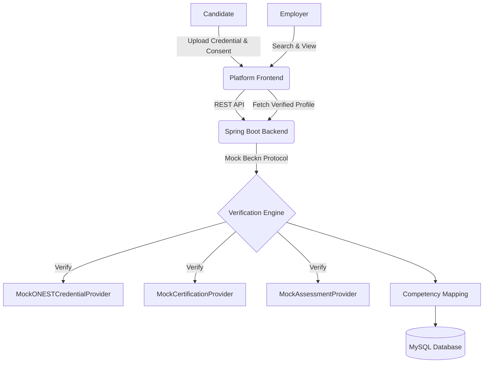

# Beckn-Based Skill Verification Network Prototype

## Project Objective
This project is a working MVP prototype for a Beckn-Based Skill Verification Network. It allows a candidate to upload their credentials, give consent for verification, and uses mock external providers (ONEST/Credential Provider, Certification Provider, Assessment Provider) to verify the skills and map competency levels. Employers can then search for candidates and view their verified profiles and evidence.

## Architecture



## Technology Stack
- **Backend:** Java 17, Spring Boot (Web, Data JPA), MySQL
- **Frontend:** React, Vite, Tailwind CSS, React Router, Axios

## Setup & Running Locally

### 1. Database Setup (MySQL)
1. Ensure MySQL is running on `localhost:3306`.
2. Create a database named `skill_verification`:
   ```sql
   CREATE DATABASE skill_verification;
   ```
3. The backend is configured to use username `root` and an empty password by default. If your credentials differ, update them in `backend/src/main/resources/application.properties`.
4. The database schema will be automatically generated, and mock data (users, skills) will be seeded on the first startup.

### 2. Run Backend
```bash
cd backend
mvn spring-boot:run
```
The backend runs on `http://localhost:8080`.

### 3. Run Frontend
```bash
cd frontend
npm install
npm run dev
```
The frontend runs on `http://localhost:5173`.

## Demo Credentials
- **Candidate:** `candidate@test.com` / `password`
- **Employer:** `employer@test.com` / `password`

## Prototype Limitations
- **Real ONEST/Beckn:** This prototype uses mock service classes (`MockONESTCredentialProvider`, etc.) to simulate external providers. In a real application, these interfaces would be implemented to communicate over the Beckn protocol.
- **Authentication:** A simplified mock authentication is used instead of real JWT/OAuth.
- **Infrastructure:** Complex microservices, Kafka, Redis, and Kubernetes have been intentionally avoided to keep the MVP simple, runnable, and focused on the core workflow.
